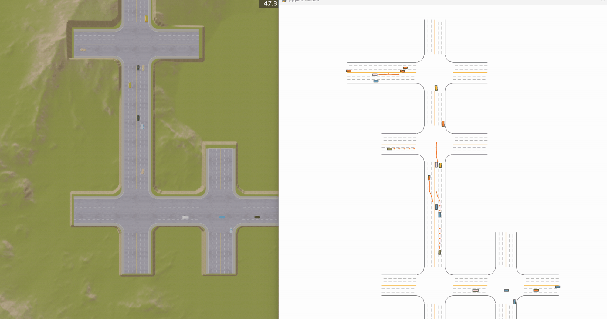

[English Version](README.md)

# Cooperative MARL Driving on MetaDrive

基于 MetaDrive 的多智能体协同驾驶实验仓库，聚焦通信受限条件下的协同决策、鲁棒性评估与混合交通测试。核心研究代码位于 `marl_project/`，底层模拟器源码位于 `metadrive/`。

## 项目预览



## 项目内容

- 基于图通信的多智能体协同驾驶训练与评估
- 支持多种对比模式：`ours`、`no_comm`、`no_aux`、`lidar_only`、`oracle`、`tarmac`、`mappo`、`mappo_ips`、`where2comm`
- 支持通信丢包、观测噪声、地图切换、混合交通渗透率 sweep
- 支持批量 checkpoint 评估、失败案例导出、可视化渲染与推理开销 benchmark

## 仓库结构

- `marl_project/train.py`：训练入口
- `marl_project/evaluate.py`：评估、鲁棒性测试与可视化入口
- `marl_project/benchmark_inference.py`：推理延迟、通信负载、参数量 benchmark
- `marl_project/config.py`：主实验配置
- `marl_project/config_tarmac.py`：TarMAC 对齐配置
- `marl_project/json/`：评估 sweep 配置
- `logs/marl_experiment/`：训练日志与 checkpoint 输出目录

## 环境准备

推荐在仓库根目录执行以下命令。

### 方式一：使用环境文件

```bash
conda env create -f metadrive_env.yml
conda activate metadrive
pip install -e .
```

### 方式二：使用 pip

```bash
pip install -r requirements.txt
pip install -e .
```

## `marl_project` 快速使用

### 1. 训练模型

从仓库根目录启动训练：

```bash
python marl_project/train.py --exp_name baseline_intent_gat --experiment_mode ours --device cuda:0
```

常用 `--experiment_mode`：

- `ours`
- `no_comm`
- `no_aux`
- `lidar_only`
- `oracle`
- `tarmac`
- `mappo`
- `mappo_ips`
- `where2comm`

### 2. 查看训练输出

训练结果默认保存在 `logs/marl_experiment/<exp_name>/`，常见文件包括：

- `best_model.pth`
- `best_success_model.pth`
- `ckpt_*.pth`
- `hparams.json`

通常推荐优先使用 `best_success_model.pth` 做后续评估。

### 3. 评估单个 checkpoint

```bash
python marl_project/evaluate.py --model_path logs/marl_experiment/baseline_intent_gat/best_success_model.pth --model_type ours --episodes 20 --save_json logs/eval_ours.json
```

### 4. 进行混合交通压力测试

```bash
python marl_project/evaluate.py --model_path logs/marl_experiment/baseline_intent_gat/best_success_model.pth --model_type ours --mpr_sweep marl_project/json/eval_stress.json --episodes 20 --save_json logs/eval_stress.json
```

### 5. 做通信鲁棒性测试

```bash
python marl_project/evaluate.py --model_path logs/marl_experiment/baseline_intent_gat/best_success_model.pth --model_type ours --mask 0.10 --episodes 20 --save_json logs/eval_mask_0.10.json
```

### 6. 可视化渲染模型行为

```bash
python marl_project/evaluate.py --model_path logs/marl_experiment/baseline_intent_gat/best_success_model.pth --model_type ours --episodes 3 --render --top_down --pause_at_end
```

### 7. 统计推理开销

```bash
python -m marl_project.benchmark_inference
```

该脚本会输出不同方法的单步推理延迟、通信负载与参数量，并将结果保存到 `logs/eval_compare/inference_cost.csv`。

## 配置入口

如果你想快速调整实验设置，优先查看 `marl_project/config.py`。常改参数包括：

- `NUM_AGENTS`
- `MAP_MODE` / `MAP_BLOCK_NUM` / `MAP_TYPE`
- `LR` / `BATCH_SIZE` / `PPO_EPOCHS`
- `COMM_RADIUS` / `MASK_RATIO` / `NOISE_STD`
- `EXPERIMENT_MODE`

## 说明

- 所有命令默认从仓库根目录执行
- `marl_project` 是本项目的主要实验目录，`metadrive/` 是底层环境代码
- 如果你想做统一对比实验，建议固定 `config.py` 后只通过命令行切换 `--experiment_mode` 和 `--exp_name`
